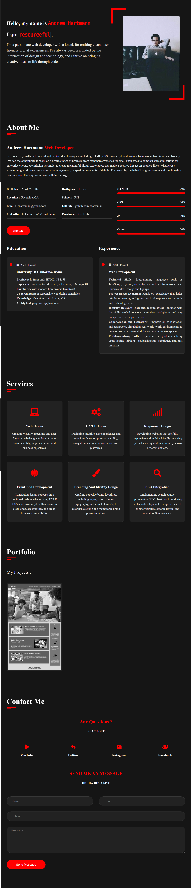

# Andrew's Journal

 

## Desciption 

This HTML CSS Redux was created for UCI Boot Camp Module One Challenge as an example on how to improve the codebase for long-term sustainability. It contains HTML and CSS code that has been reworked to follow semantic structure of HTML and consolidated CSS selectors and properties.  

## Usage

The following image shows the web application's appearance and functionality: 

[Visit my website](https://haartmuhn.github.io/Andrews-Journal/)

## License 

[MIT License](https://opensource.org/licenses/MIT)